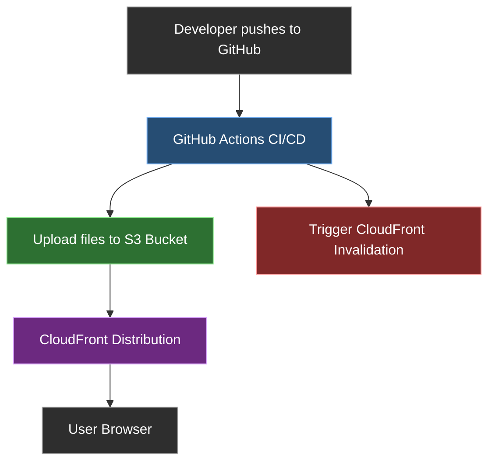

# 🌐 Portfolio Deployment with AWS 

This project automates the deployment of a static portfolio website using:
- **Amazon S3** for static file storage and hosting
- **Amazon CloudFront** for global content delivery and HTTPS
- **Amazon Route 53** for custom domain DNS
- **GitHub Actions** for continuous deployment from a GitHub repo

> ⚡️ Live at: [https://chetansoni.tech](https://chetansoni.tech)

---

## 🚀 Features

- ⚙️ Automated CI/CD via GitHub Actions
- 🌍 Custom domain with SSL (HTTPS)
- 🌐 CDN-backed performance using CloudFront
- 📁 Easy to update: push to GitHub → auto-deploys to AWS

---

## 🧱 Architecture


---

## 📂 Project Structure

```
.
├── index.html
├── styles.css
├── script.js
├── assets/
├── .github/
│   ├── workflow/
│   │   ├── main.yml
└── README.md
```

